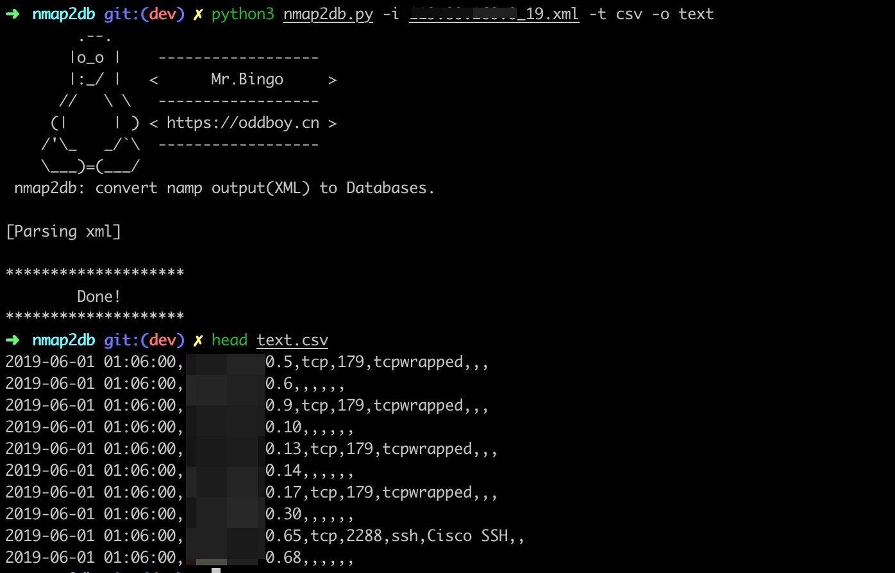
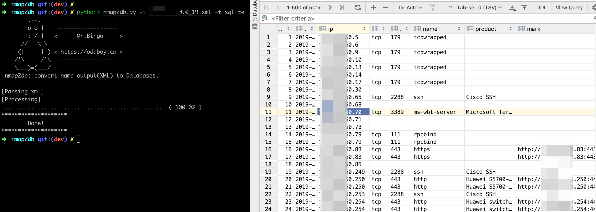
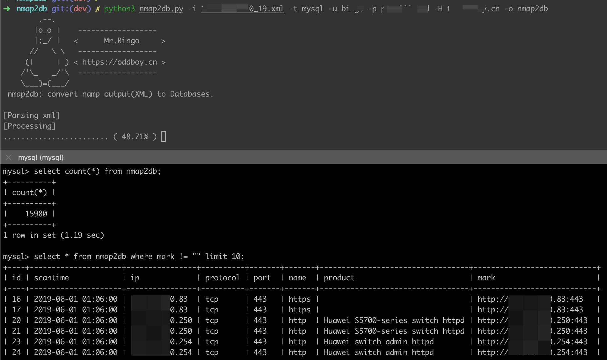

# Nmap2DB: convert namp output(XML) to Databases.

当使用 Nmap 扫描大目标时，往往结果太多，其自带的输出格式不利于查阅。故而开发此小工具。

> 当前实测csv,sqlite,mysql输出，其他类型的数据库尚未实际测试。 如有问题，可提交issue，我抽时间完善。
## Usage
```bash
✗ python3 nmap2db.py -h
        .--.
       |o_o |    ------------------
       |:_/ |   <      Mr.Bingo     >
      //   \ \   ------------------
     (|     | ) < https://oddboy.cn >
    /'\_   _/`\  ------------------
    \___)=(___/
 nmap2db: convert namp output(XML) to Databases.

usage: nmap2db.py [-h] -i XML -t {postgresql,mysql,oracle,mssql,sqlite,csv}
                  [-u USERNAME] [-p PASSWORD] [-H HOST] [-P PORT] [-o DB]

optional arguments:
  -h, --help            show this help message and exit
  -i XML                Nmap output xml file, you can get it by : nmap
                        192.168.0.1/24 -oX output.xml
  -t {postgresql,mysql,oracle,mssql,sqlite,csv}
                        Database Type, eg: PostgreSQL, MySQL, Oracle, MSSql,
                        SQLite, CSV
  -u USERNAME           DB username
  -p PASSWORD           DB password
  -H HOST               DB host
  -P PORT               DB port
  -o DB                 DB Schema or DB file path
```

## Sample

- 导出到csv

`python3 nmap2db.py -i xxx.xml -t csv`


- 导出到sqlite

`python3 nmap2db.py -i xxx.xml -t sqlite -o nmapresult`


- 导出到MySQL

`python3 nmap2db.py -i 192.168.1.0_19.xml -t mysql -u user -p pass -H localhost -o nmap2db`

